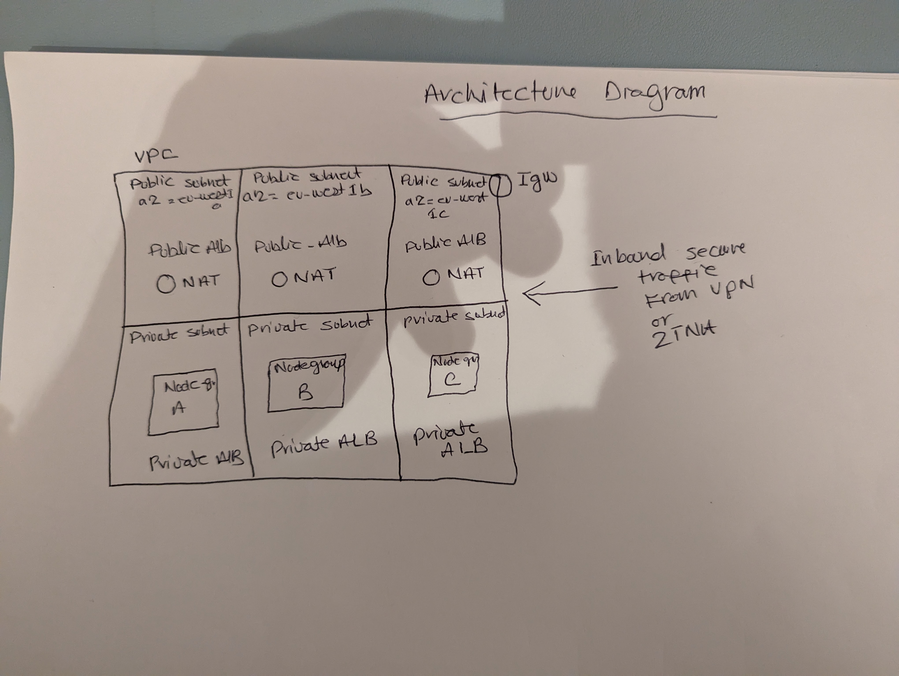

# Highly Available EKS cluster deployment with Terraform
## Features
* A dedicated VPC with highly available NAT gateways
* A node group per AZ in the private subnet
* Nodegrops running bottlerocket ami
* Nodes accepting traffic only from private and pubic alb
* Cluster autoscaling enabled.
* IRSA enabled
* Both private and public ALB accepting traffic only over HTTPS
* All ebs volumes are encrypted with KMS key

